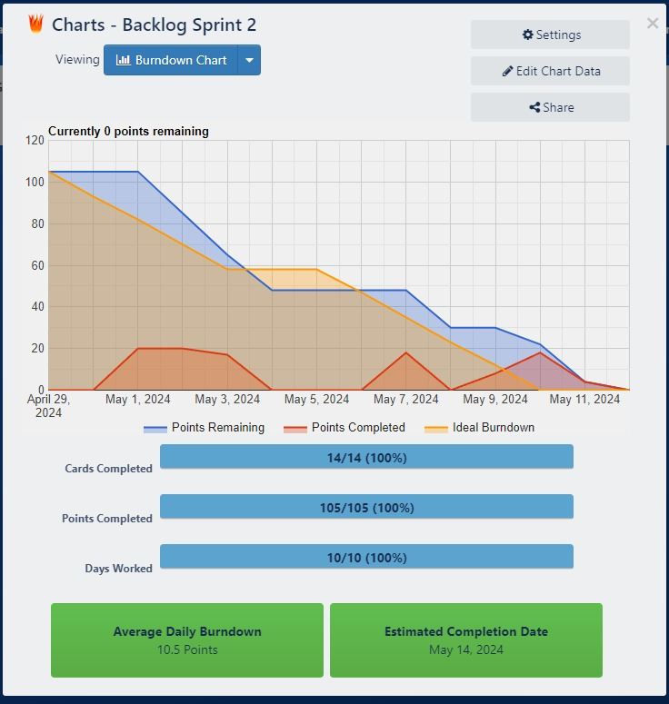

<h1 align = "center" > Fatec Jacareí- DSM 1º SEMESTRE</h1>

# 
Equipe: 🪄:💻: TechWizards 

 

# SOBRE O PROJETO 
## 
 Com o intuito de desenvolver uma aplicação Web usando metodologias ágeis a FATEC DE JACAREÍ propôs aos alunos do 1° semestre do curso de Desenvolvimento de Software Multiplataforma (DSM), o desenvolvimento de um curso online sobre o metodo ágil Scrum, que define-se como um framework de colaboração de equipe ágil comumente usado.

## SPRINTS

| Sprint | Link        | Início      | Entrega     | Status |
|--------|-------------|-------------|-------------|--------|
| 01     | [Sprint 01](#sprint-1) | 25/03/2024  | 18/04/2024  | ✔      |
| 02     | [Sprint 02](#sprint2) | 22/04/2024  | 15/05/2024  |        |
| 03     | [Sprint 03](#sprint3) | 20/05/2024  | 12/06/2024  |        |

 

 

## :page_with_curl: Product Backlog 

> - RF - Requisito Funcional

> - RNF - Requisito Não Funcional

| REQUISITO FUNCIONAL_ID | REQUISITOS                                                                                                     | SPRINTS |
|------------------------|----------------------------------------------------------------------------------------------------------------|---------|
| RF - 1                 | Criação de um protótipo do site                                                                                | #01 ✔   |
| RF - 2                 | Criar um Cadastro de usuário para o usuário se cadastrar                                                       |         |
| RF - 3                 | Usuário deve ser capaz de fazer Login de Acesso utilizando email cadastrado                                    |         |
| RF - 4                 | Elaborar o Conteúdo do Curso, que será divido em aulas                                                         | #01 ✔   |
| RF - 5                 | Ao finalizar todas as aulas do conteúdo do curso, o usuário deve conseguir realizar uma Avaliação de Desempenho com 20 questoes que devem ser sorteadas aleatóriamente | #01 ✔   |
| RF - 6                 | O usuário do site deve ser capaz de emitir Certificado de Conclusão ao finalizar o curso                        |         |
| RF - 7                 | Criar o Modelo Visual do site                                                                                  | #01 ✔   |
| RF - 8                 | Navegabilidade do site                                                                                         | #01 ✔   |

| REQUISITO NÃO_FUNCIONAL_ID | REQUISITOS                                                                 | SPRINTS |
|----------------------------|----------------------------------------------------|---------|
| RNF - 1                    | Utilizar HTML5 para arquitetura da informação da aplicação                 | #01 ✔   |
| RNF - 2                    | Utilizar CSS 3 para especificação do layout e demais características de renderização da interface com o usuário | #01 ✔   |
| RNF - 3                    | Utilizar JavaScript no front end (obs.: não pode fazer uso de frameworks)  |         |
| RNF - 4                    | Utilizar DB Design para fazer a modelagem do BD                            | #01 ✔   |
| RNF - 5                    | Sistema responsivo                                                         |         |
| RNF - 6                    | Utilizar o sistema gerenciador de banco de dados PostGresSQL               |         |
 

## :page_with_curl: USER STORIES
 

| ID REFERENCIA | Remetente | Instrução | Finalidade | 
|---------------|-----------|-----------|------------|
| RF - 1        | Cliente   | Como cliente, quero poder visualizar um protótipo do site | Para entender sua estrutura e funcionalidades |   
| RF - 2/ RF - 3| Cliente   | Como cliente, eu quero que os usuários consigam se cadastrar no site e fazer login | Para terem acesso ao conteúdo do curso |   
| RF - 4        | Usuário   | Como usuário, quero acessar o conteúdo do curso, organizado e de fácil entendimento | Para adquirir conhecimento e habilidades através do curso oferecido |   
| RF - 5        | Usuário   | Como usuário, quero ser capaz de realizar uma avaliação de desempenho após concluir o curso | Para avaliar meu progresso e compreensão do curso |  
| RF - 6        | Cliente   | Como cliente, eu quero que os usuários consigam emitir certificado após realizar uma avaliação de desempenho do curso | Para validar a finalização do curso e o conhecimento adquirido |   
| RF - 7/ RNF-5 | Cliente   | Como cliente, quero ter um Modelo Visual do site intuitivo e responsivo | Para que os usuários tenham facilidade em navegar pelo site, independente do dispositivo pelo qual estão acessando  |   

## :page_with_curl: MODELO RELACIONAL
 

## :page_with_curl: GRUPO
 

| NOME               | FUNÇÃO        | GITHUB                               |
|--------------------|---------------|--------------------------------------|
| Pollyana Roberta   | Scrum Master  | https://github.com/Pollymeowth |
| Bruna Regra        | Project Owner | https://github.com/regrabru      |
| Raquel Nakamura    | Developer     | https://github.com/nakamuraraquel |
| Maria Eduarda      | Developer     | https://github.com/ferreira-me |
| Felipe Correa      | Developer     | https://github.com/turnupthetaste |
| Pamela Freitas     | Developer     | https://github.com/PaamFreitas18 |
| Leandro Barbosa    | Developer     | https://github.com/gmlebc|

 

 
## :page_with_curl: SPRINT 1 

Na Primeira Sprint realizamos o levantamento dos Requisitos com o cliente, através do Product Owner, para definirmos melhor os Requisitos Funcionais (RF) e os Requisitos Não Funcionais (RNF) do produto e criamos a Backlog List do produto. Através da Backlog List, criamos o Backlog da Sprint 1 e definimos as tarefas que cada um dos membros da equipe iriam executar nessa etapa. . Definimos os elementos das páginas, fazendo o protótipo das mesmas usando Figma e usamos HTML5 e CSS3 para criar o protótipo da primeira página do site. Além disso, foi criado o Modelo Entidade Relacionamento para desenvolvimento do Banco de Dados e começamos a desenvolver outras etapas, como a elaboração de conteúdos para o site, que serão implementadas nas próximas sprints. Criamos ainda o Repositório no GitHub para manter o controle das alterações feitas durante a realização do projeto e organização e o Readme.MD para apresentação do nosso projeto. 

 

### - Sprint Backlog 
| ID REFERENCIA |Pioridade (Scrum Poker Planning) | REQUISITO DA SPRINT| Responsável |TAREFA INICIADA | TAREFA CONCLUIDA | 
|---------------|--------------------|---------------|-----------------|-----------------|------------------|
|  RF - 1    | 2 |Definir elementos das páginas para criar os protótipos iniciais |Maria Eduarda | ✔  |✔  |
|  RF - 1    | 3 |Criar protótipos das telas no Figma   |Bruna e Raquel | ✔  |✔  |
|  RF - 4 /RF - 5 | 5 |Pesquisar o conteúdo e elaborar as 20 questões que serão utilizadas e selecionadas aleatoriamente (parcial).|Pamela  | ✔  |✔  |
|  RF - 7    | 3 |Definir paleta de cores e contrastes para o site |Raquel|  ✔  |✔  |
|  RF - 8    | 3 |Elaboração da navegabilidade do site usando Figma |Bruna   | ✔  |✔  |
|  RNF - 1    | 8 |Desenvolver a primeira versão do index.html e criar o protótipo HTML da página de cadastro. |Pollyana |  ✔  |✔  |
|  RNF - 2    | 8 |Estilizar e integrar o arquivo CSS ao index.html conforme customização definida pela equipe.|Leandro  | ✔  |✔  |
|  RNF - 4    | 6 |Modelo Relacional do BD|Felipe |  ✔  |✔  |
 
 

### - Burndown Sprint 1

### - Sprint Retrospective 
1.	O que funcionou bem durante o sprint?
Durante esta sprint, várias coisas funcionaram muito bem. Uma delas foi a colaboração da equipe. Todos estavam comprometidos e trabalhando em sincronia, o que nos permitiu alcançar nossos objetivos dentro do prazo. A comunicação melhorou significativamente, e a divisão de tarefas também, onde cada membro se dispôs a desenvolver uma parte porem o grupo inteiro aprovava no final. Isso ajudou a evitar mal-entendidos e a manter todos atualizados sobre o progresso do projeto. Também implementamos algumas novas práticas de desenvolvimento que resultaram em maior eficiência e qualidade. Esses elementos combinados contribuíram para um sprint bem-sucedido e nos deixam otimistas para os próximos desafios.

2.	O que não funcionou tão bem durante o sprint?
Durante o sprint, enfrentamos alguns desafios inesperados, como desistências repentinas de membros da equipe, incluindo desenvolvedores e até mesmo o Scrum Master. Isso exigiu uma rápida e eficaz reorganização para garantir a continuidade do desenvolvimento e o cumprimento dos prazos de entrega.

3.	Quais ações podemos tomar para melhorar no próximo sprint?
Podemos revisar e aprimorar nossas práticas de desenvolvimento, identificando áreas específicas para melhorias e implementando ajustes conforme necessário. Ao fazer essas melhorias e aprender com os desafios enfrentados no sprint, podemos nos posicionar ainda melhor para alcançar nossos objetivos no próximo sprint.

## :page_with_curl: SPRINT 2 

 Na Sprint 2, avançamos significativamente no desenvolvimento do projeto. Começamos criando as tabelas no banco de dados PostgreSQL para gerenciar o cadastro e consulta de registros, assegurando que todas as consultas retornem resultados corretos. Além disso, dedicamos esforços à estilização das páginas do site, garantindo que todos os elementos estejam conforme o modelo visual estabelecido. Para uma experiência de navegação suave, todos os links foram devidamente referenciados, garantindo que levem aos seus destinos apropriados. Também não esquecemos de atualizar a estrutura do README.md, incluindo detalhes relevantes sobre a Sprint 2, como o Sprint Backlog e o gráfico de Burndown, proporcionando uma visão clara do progresso alcançado nesta etapa do projeto. 

### - Sprint Backlog 
| ID REFERENCIA | Scrum Poker Planning | ATIVIDADE | REQUISITO DA SPRINT | Responsável | TAREFA CONCLUIDA |
|---------------|----|---------------------------|---------------------|-------------|------------------|
| RNF - 1       | 6  | HTML das páginas 2 e 3 | As páginas devem conter todos os elementos definidos para elas | Raquel |  ✔  |
| RNF - 2       | 8  | CSS das páginas 2 e 3 | Seguir o padrão da estilização de acordo com o modelo visual | Raquel | ✔   |
| RNF - 1       | 6  | HTML das páginas 4 e 5 | As páginas devem conter todos os elementos definidos para elas | Maria Eduarda |  ✔ |
| RNF - 2       | 8  | CSS das páginas 4 e 5 | Seguir o padrão da estilização de acordo com o modelo visual | Maria Eduarda | ✔  |
| RNF - 1       | 6  | HTML das páginas 6 e 7 | As páginas devem conter todos os elementos definidos para elas | Bruna |  ✔  |
| RNF - 2       | 8  | CSS das páginas 6 e 7 | Seguir o padrão da estilização de acordo com o modelo visual | Bruna |  ✔  |
| RNF - 1       | 9  | HTML das páginas 8, 9 e 10 | As páginas devem conter todos os elementos definidos para elas | Pollyana |  ✔  |
| RNF - 2       | 12 | CSS das páginas 8, 9 e 10 | Seguir o padrão da estilização de acordo com o modelo visual | Pollyana |  ✔  |
| RNF - 1       | 6  | HTML das páginas 11 e 12 | As páginas devem conter todos os elementos definidos para elas | Leandro |  ✔  |
| RNF - 2       | 8  | CSS das páginas 11 e 12 | Seguir o padrão da estilização de acordo com o modelo visual | Leandro |  ✔  |
| RF - 8        | 8  | Menu com Links | Todos os links clicáveis devem levar para suas respectivas referências | Pollyana |  ✔  |
| RNF - 4       | 8  | Criar o Banco de Dados no PostgreSQL | Criar as tabelas no Banco de Dados para acesso PostgreSQL | Felipe | ✔ |
| RNF - 6       | 6  | Cadastro de registros no Banco | Ser capaz de implementar o sistema de registro/inclusão de usuário no banco de dados | Felipe |  ✔ |
| RNF - 6       | 6  | Cadastro de registros no Banco | Ser capaz de fazer consultas e retornar resultados corretamente no banco de dados | Pamela | ✔  |

 
 

### - Burndown Sprint 2

 
 

## :page_with_curl: SPRINT 3

### - Sprint Backlog 
| ID REFERENCIA | Scrum Poker Planning | ATIVIDADE | REQUISITO DA SPRINT | Responsável | TAREFA CONCLUIDA |
|---------------|----|---------------------------|---------------------|-------------|------------------|
| RNF - 1       | - | Cadastrar usuário no SGBD | Deve ser possível realizar o cadastro do usuário usando nome e email | Felipe |   |
| RNF - 2       | -  |Login de usuário no servidor| O usuário deve ser capaz de realizar login em sua conta usando nome e email | Raquel |   |
| RNF - 1       | -  | Obter as questões no front end| Integrar JS e HTML/CSS para obter questões na página de questões | Maria Eduarda |   |
| RNF - 2       | -  | Salvar pontuação| O sistema deve ser capaz de salvar a pontuação no BD | Maria Eduarda |   |
| RNF - 1       | -  |Recuperar questões respondidas no servidor | O sistema deve ser capaz de guardar e consultar as questões que já foram respondidas pelo usuário| Bruna |    |
| RNF - 2       | -  | Organização do código (CSS e JS externo; estrutura das marcações, estilos e JS)| Fazer a organização e associar o JS ao CSS | Polly e Bruna |    |
| RNF - 1       | -  | Visual responsivo (uso de CSS média queries) |Fazer o site se adaptar bem em diferente dispositivos, melhorando a experiência do usuário | Polly |    |
| RNF - 2       | - | Gerar certificado | Consultar as informações do usuário no site para emitir certificado, caso o usuário se qualifique para obtê-lo | Pollyana |    |
| RNF - 1       | -  | Página de questões |O sistema deve ser capaz de exibir a página de questões| Leandro |   |
| RNF - 2       | -  | Arquitetura da informação | Fazer um modelo/conceito de informação para detalhar o sistema | Pamela |   |
| RF - 8        | -  | Consultas para atualizar registros|O BD deve ser persistente e ser capaz de sofrer atualizações nos registros de usuários | Pollyana |    |
| RNF - 4       | -  | Execução do back end em linux| Usar a ferramenta da Azure para criar uma instância para fazer rodar o Linux | Leandro |  |

