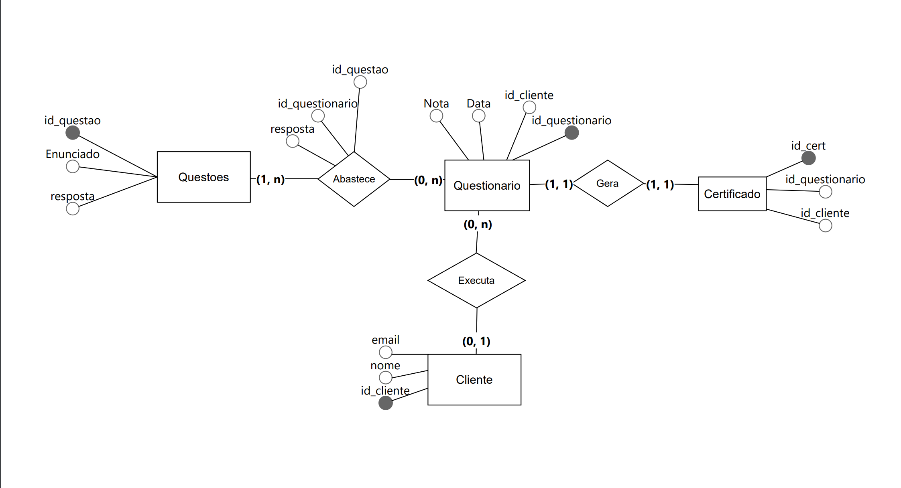

<h1 align = "center" > Fatec Jacareí- DSM 1º SEMESTRE</h1>

# 
Equipe: 🪄:💻: TechWizards 

 

# SOBRE O PROJETO 
## 
 Com o intuito de desenvolver uma aplicação Web usando metodologias ágeis a FATEC DE JACAREÍ propôs aos alunos do 1° semestre do curso de Desenvolvimento de Software Multiplataforma (DSM), o desenvolvimento de um curso online sobre o metodo ágil Scrum, que define-se como um framework de colaboração de equipe ágil comumente usado.

## Sprints

| Sprint | Link        | Início      | Entrega     | Status |
|--------|-------------|-------------|-------------|--------|
| 01     | [Sprint 01](#sprint-1) | 25/03/2024  | 18/04/2024  | ✔      |
| 02     | [Sprint 02](#sprint2) | 22/04/2024  | 15/05/2024  |        |
| 03     | [Sprint 03](#sprint3) | 20/05/2024  | 12/06/2024  |        |

 

 

## :page_with_curl: Product Backlog 

> - RF - Requisito Funcional

> - RNF - Requisito Não Funcional

| REQUISITO FUNCIONAL_ID | REQUISITOS                                                                                                     | SPRINTS |
|------------------------|----------------------------------------------------------------------------------------------------------------|---------|
| RF - 1                 | Criação de um protótipo do site                                                                                | #01 ✔   |
| RF - 2                 | Criar um Cadastro de usuário para o usuário se cadastrar                                                       |         |
| RF - 3                 | Usuário deve ser capaz de fazer Login de Acesso utilizando email cadastrado                                    |         |
| RF - 4                 | Elaborar o Conteúdo do Curso, que será divido em aulas                                                         | #01 ✔   |
| RF - 5                 | Ao finalizar todas as aulas do conteúdo do curso, o usuário deve conseguir realizar uma Avaliação de Desempenho com 20 questoes que devem ser sorteadas aleatóriamente | #01 ✔   |
| RF - 6                 | O usuário do site deve ser capaz de emitir Certificado de Conclusão ao finalizar o curso                        |         |
| RF - 7                 | Criar o Modelo Visual do site                                                                                  | #01 ✔   |
| RF - 8                 | Navegabilidade do site                                                                                         | #01 ✔   |

| REQUISITO NÃO_FUNCIONAL_ID | REQUISITOS                                                                 | SPRINTS |
|----------------------------|----------------------------------------------------|---------|
| RNF - 1                    | Utilizar HTML5 para arquitetura da informação da aplicação                 | #01 ✔   |
| RNF - 2                    | Utilizar CSS 3 para especificação do layout e demais características de renderização da interface com o usuário | #01 ✔   |
| RNF - 3                    | Utilizar JavaScript no front end (obs.: não pode fazer uso de frameworks)  |         |
| RNF - 4                    | Utilizar DB Design para fazer a modelagem do BD                            | #01 ✔   |
| RNF - 5                    | Sistema responsivo                                                         |         |
| RNF - 6                    | Utilizar o sistema gerenciador de banco de dados PostGresSQL               |         |
 

## :page_with_curl: USER STORIES
 

| ID REFERENCIA | Remetente | Instrução | Finalidade | Pioridade |
|---------------|-----------|-----------|------------|------------------|
| RF - 1        | Cliente   | Como cliente, quero poder visualizar um protótipo do site | Para entender sua estrutura e funcionalidades |   |
| RF - 2/ RF - 3| Cliente   | Como cliente, eu quero que os usuários consigam se cadastrar no site e fazer login | Para terem acesso ao conteúdo do curso |   |
| RF - 4        | Usuário   | Como usuário, quero acessar o conteúdo do curso, organizado e de fácil entendimento | Para adquirir conhecimento e habilidades através do curso oferecido |   |
| RF - 5        | Usuário   | Como usuário, quero ser capaz de realizar uma avaliação de desempenho após concluir o curso | Para avaliar meu progresso e compreensão do curso |  |
| RF - 6        | Cliente   | Como cliente, eu quero que os usuários consigam emitir certificado após realizar uma avaliação de desempenho do curso | Para validar a finalização do curso e o conhecimento adquirido |   |
| RF - 7/ RNF-5 | Cliente   | Como cliente, quero ter um Modelo Visual do site intuitivo e responsivo | Para que os usuários tenham facilidade em navegar pelo site, independente do dispositivo pelo qual estão acessando  |   |

## :page_with_curl: MODELO RELACIONAL
 

## :page_with_curl: GRUPO
 

| NOME                | FUNÇÃO        | GITHUB                               |
|--------------------|---------------|--------------------------------------|
| Pollyana Roberta   | Developer     | https://github.com/Pollymeowth |
| Bruna Regra        | Project Owner | https://github.com/regrabru      |
| Raquel Nakamura    | Developer     | https://github.com/nakamuraraquel |
| João Otávio        | Scrum Master  | https://github.com/jotavionm |
| Maria Eduarda      | Developer     | https://github.com/ferreira-me |
| Felipe Correa      | Developer     | https://github.com/turnupthetaste |
| Pamela Freitas     | Developer     | https://github.com/PaamFreitas18 |
| Leandro Barbosa    | Developer     | https://github.com/gmlebc|

 
## :page_with_curl: SPRINT 1 

Na Primeira Sprint realizamos o levantamento dos Requisitos com o cliente, através do Product Owner, para definirmos melhor os Requisitos Funcionais (RF) e os Requisitos Não Funcionais (RNF) do produto e criamos a Backlog List do produto. Através da Backlog List, criamos o Backlog da Sprint 1 e definimos as tarefas que cada um dos membros da equipe iriam executar nessa etapa. . Definimos os elementos das páginas, fazendo o protótipo das mesmas usando Figma e usamos HTML5 e CSS3 para criar o protótipo da primeira página do site. Além disso, foi criado o Modelo Entidade Relacionamento para desenvolvimento do Banco de Dados e começamos a desenvolver outras etapas, como a elaboração de conteúdos para o site, que serão implementadas nas próximas sprints. Criamos ainda o Repositório no GitHub para manter o controle das alterações feitas durante a realização do projeto e organização e o Readme.MD para apresentação do nosso projeto. 

## :page_with_curl: Sprint Backlog 
| ID REFERENCIA | REQUISITO DA SPRINT        | Responsável |TAREFA INICIADA | TAREFA CONCLUIDA | 
|---------------|----------------------------|-----------------|-----------------|------------------|
|  RF - 1    | Definir elementos das páginas para criar os protótipos iniciais |Maria Eduarda | ✔  |✔  |
|  RF - 1    | Criar protótipos das telas no Figma   |Bruna e Raquel | ✔  |✔  |
|  RF - 4 /RF - 5 | Pesquisar o conteúdo e elaborar as 20 questões que serão utilizadas e selecionadas aleatoriamente (parcial).|Pamela  | ✔  |✔  |
|  RF - 7    | Definir paleta de cores e contrastes para o site |Raquel|  ✔  |✔  |
|  RF - 8    | Elaboração da navegabilidade do site usando Figma |Bruna   | ✔  |✔  |
|  RNF - 1    | Desenvolver a primeira versão do index.html e criar o protótipo HTML da página de cadastro. |Pollyana |  ✔  |✔  |
|  RNF - 2    | Estilizar e integrar o arquivo CSS ao index.html conforme customização definida pela equipe.|Leandro    | ✔  |✔  |
|  RNF - 4    | Modelo Relacional do BD|Felipe |  ✔  |✔  |

